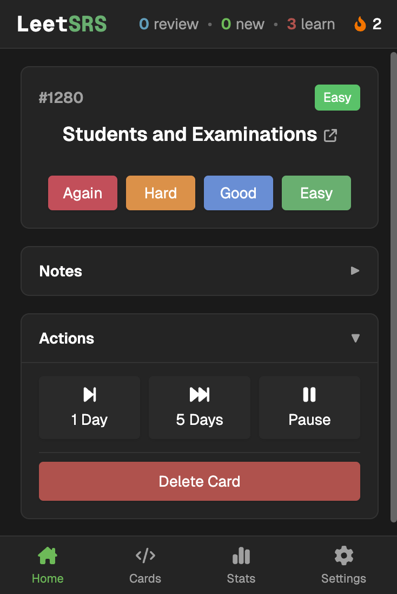
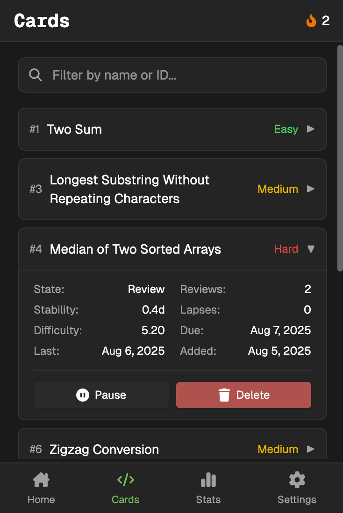
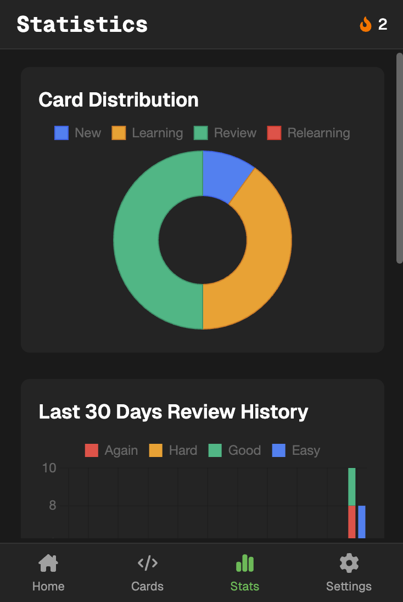
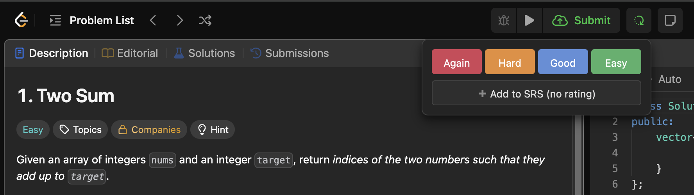

# LeetSRS

 

LeetSRS is a Chrome extension that adds spaced repetition to LeetCode problem practice.

## Screenshots

### In Extension

&nbsp;&nbsp;

&nbsp;&nbsp;

### Works directly on leetcode.com

## Features

### Spaced Repetition

- Uses **[TS-FSRS](https://github.com/open-spaced-repetition/ts-fsrs)** for the spaced repetition algorithm

### Progress Tracking

- View statistics and streaks

### LeetCode Integration

- Works directly on leetcode.com
- Easily rate after solving problems, or add to review later

### Review System

- Daily review queue with optimized problem ordering
- Customizable daily new card limits

### Interface

- Dark/light theme support

## Open Source

LeetSRS is open source and accepts contributions.

## Installation

1. Download the latest release from the Chrome Web Store (coming soon)
2. Or build from source and load as an unpacked extension

## License

MIT
